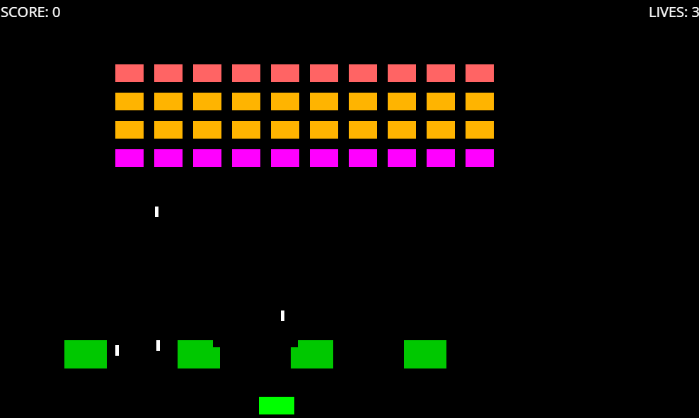

# Space Invaders em C#

Este projeto é um clone simples do clássico jogo de arcade Space Invaders, desenvolvido para Desktop (Windows) utilizando a linguagem C# e o framework Uno Platform. O foco foi criar uma base de jogo funcional e bem estruturada, seguindo princípios de Programação Orientada a Objetos.

## Funcionalidades Implementadas

-   **Menu Principal:** Tela inicial com opções para iniciar o jogo, ver placares (a implementar) e ver os controles.
-   **Sistema de Jogo Completo:**
    -   Movimento do jogador para esquerda e direita.
    -   Disparo de projéteis com tempo de recarga (*cooldown*).
    -   Sistema de 3 vidas para o jogador.
-   **Inimigos (Aliens):**
    -   Múltiplos tipos de aliens com pontuações diferentes (30, 20, 10 pontos).
    -   Movimento em bloco, que inverte a direção ao atingir as bordas da tela e desce.
    -   Capacidade de atirar de volta no jogador de forma aleatória.
-   **Barreiras Destrutíveis:** Quatro barreiras no meio da tela que podem ser destruídas por tiros do jogador e dos inimigos.
-   **Interface e Lógica de Jogo:**
    -   Contagem de pontuação (SCORE) em tempo real.
    -   Contagem de vidas (LIVES) na tela.
    -   Condição de "Game Over" e opção para reiniciar o jogo ou voltar ao menu.
    -   Condição de "Vitória" (limpar a tela de aliens) que reinicia a onda de inimigos.
-   **Áudio:** Efeitos sonoros para o disparo do jogador e para a explosão dos inimigos, implementados com a biblioteca `NAudio`.

## Tecnologias Utilizadas

-   **Linguagem:** C# (.NET)
-   **Framework:** Uno Platform (focado em Desktop)
-   **Biblioteca de Áudio:** NAudio
-   **IDE:** JetBrains Rider
-   **Estrutura:** Programação Orientada a Objetos (POO) com classes para cada entidade do jogo.

## Estrutura do Projeto

O código está organizado da seguinte forma:

-   **/ (raiz)**
    -   `HomePage.xaml`: A tela de menu principal.
    -   `MainPage.xaml`: A tela onde o jogo acontece.
    -   `ControlsPage.xaml` / `HighScoresPage.xaml`: Páginas do menu.
-   **/Models**
    -   Contém as classes que representam os objetos do jogo (`GameObject`, `Player`, `Alien`, `Bullet`), separando a lógica da apresentação.
-   **/Sounds**
    -   Armazena os arquivos de áudio (`.wav`, `.mp3`) usados no jogo.

## Como Executar o Projeto

1.  Clone este repositório.
2.  Abra o arquivo da solução (`.sln`) no JetBrains Rider ou Visual Studio.
3.  Restaure os pacotes NuGet (o IDE geralmente faz isso automaticamente).
4.  Certifique-se de que o projeto `spaceInvaders.Desktop` está definido como o projeto de inicialização.
5.  Compile e execute o projeto (Shift + F10 no Rider).

## Controles do Jogo

-   **Mover para Esquerda:** Seta Esquerda ou Tecla A
-   **Mover para Direita:** Seta Direita ou Tecla D
-   **Atirar:** Barra de Espaço
-   **Reiniciar (na tela de Game Over):** Enter

## Próximos Passos (Possíveis Melhorias)

-   [ ] Implementar um sistema de **High Scores** funcional, salvando as pontuações em um arquivo.
-   [ ] Trocar os `Rectangle` por **imagens/sprites** para um visual mais clássico.
-   [ ] Adicionar **aumento de dificuldade** (aliens mais rápidos ou que atiram com mais frequência a cada onda).
-   [ ] Adicionar mais **efeitos sonoros** (música de fundo, som do jogador sendo atingido).
